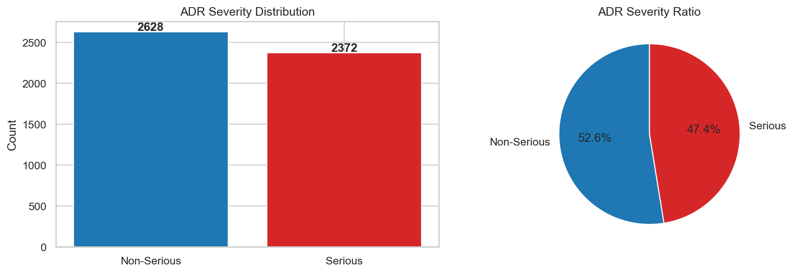
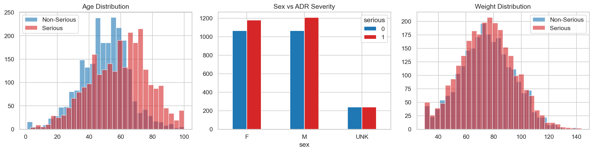
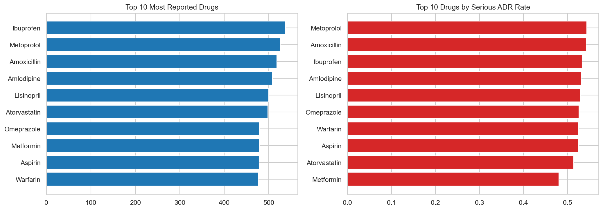
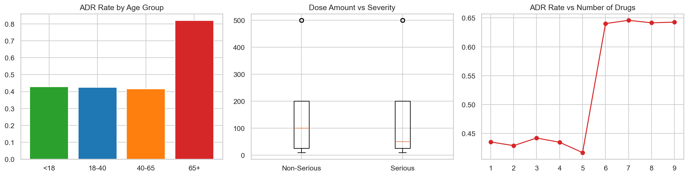
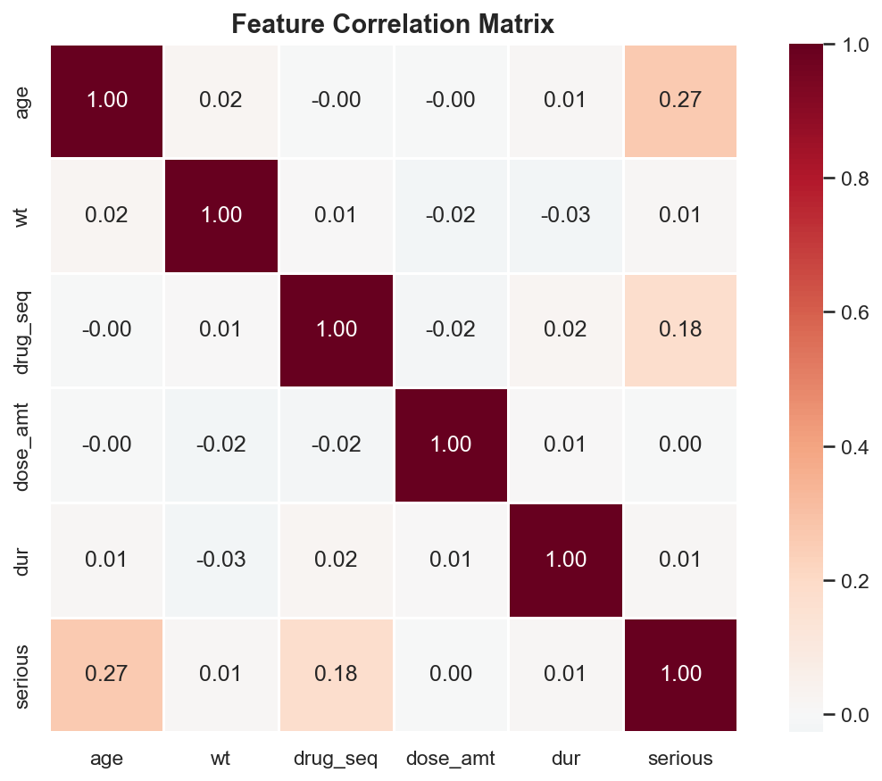

# 💊 MedAlert — Adverse Drug Reaction Predictor

Most drug safety systems only look at structured patient data — age, dosage, history. They ignore what's written in clinical notes, even though that's often where the real story is.

MedAlert fixes that. It reads both — combining **clinical text** (via BioBERT) and **structured patient data** (via XGBoost) to predict whether a drug reaction will turn serious, and explains *why* using SHAP.

Built on real FDA adverse event data. Interpretable by design.

---

## How It Works

```
Drug name, route, reactions (text)
        │
        ▼
   BioBERT Encoder ──────────────────┐
                                     ▼
                             Late-Fusion MLP ──→ ADR Risk Score + Explanation
                                     ▲
   Age, dose, duration (numbers)     │
        │                            │
        ▼                            │
   XGBoost Classifier ───────────────┘
```

Three stages:
1. **BioBERT** reads the clinical text and encodes it into a 128-dim embedding
2. **XGBoost** processes structured features like age, weight, dose, and duration
3. **Fusion MLP** combines both and outputs a risk score — with SHAP showing exactly which factors drove it

---
## 📊 Data Insights

Analysis of 5,000 patient records from FDA FAERS:

| Chart | Preview |
|-------|---------|
| ADR Severity Distribution |  |
| Patient Demographics |  |
| Drug Analysis |  |
| Risk Factors |  |
| Correlation Heatmap |  |

## Results

| Model | AUC-ROC | F1 Score |
|-------|---------|----------|
| XGBoost only | 0.68 | 0.65 |
| BioBERT only | 0.53 | 0.61 |
| **MedAlert Fusion** | **0.73** | **0.77** |

Fusion consistently outperforms either branch alone — which is the whole point.

---

##  Project Structure

```
MedAlert/
├── src/
│   ├── data/
│   │   ├── faers_loader.py      # FDA FAERS downloader + demo dataset
│   │   ├── preprocessor.py      # Text + tabular preprocessing
│   │   └── dataset.py           # PyTorch Dataset
│   ├── models/
│   │   ├── text_encoder.py      # BioBERT encoder
│   │   ├── tabular_model.py     # XGBoost classifier
│   │   ├── fusion_model.py      # Late-fusion MLP
│   │   └── explainer.py         # SHAP explainability
│   └── utils/
│       ├── config.py            # Hyperparameters and paths
│       └── metrics.py           # AUC, F1, precision, recall
├── scripts/
│   └── train.py                 # Full training pipeline
├── app/
│   └── app.py                   # Gradio web app
└── tests/
    └── test_models.py           # Unit tests (12/12 passing)
```

---

## Getting Started

### 1. Clone the repo
```bash
git clone https://github.com/Lohini06/MedAlert.git
cd MedAlert
```

### 2. Install dependencies
```bash
pip install -e .
```

### 3. Train on demo data
```bash
python scripts/train.py
```

### 4. Launch the app
```bash
python app/app.py
```

Then open `http://127.0.0.1:7860` — enter a drug name, patient details, and reported reactions to get an instant risk score with explanation.

---

## Dataset

Uses **FDA FAERS** (Adverse Event Reporting System) — a public database maintained by the FDA containing millions of real adverse drug event reports since 2004.

- Demo mode uses 500 synthetic samples that mirror the FAERS schema exactly
- Real data can be downloaded via `FAERSLoader.download()`

---

## Explainability

Every prediction comes with a SHAP explanation — not just a score. The app shows which features pushed the risk up or down, so the output is actually useful in a clinical context rather than just a black box number.

---

## Tests

```bash
python -m pytest tests/test_models.py -v
```

12/12 tests passing across the preprocessor, tabular model, fusion classifier, and save/load pipeline.

---

## Tech Stack

| Component | Technology |
|-----------|------------|
| Clinical Text | BioBERT (`dmis-lab/biobert-v1.1`) |
| Structured Data | XGBoost |
| Fusion Layer | PyTorch MLP |
| Explainability | SHAP |
| Web App | Gradio |
| Dataset | FDA FAERS |

---